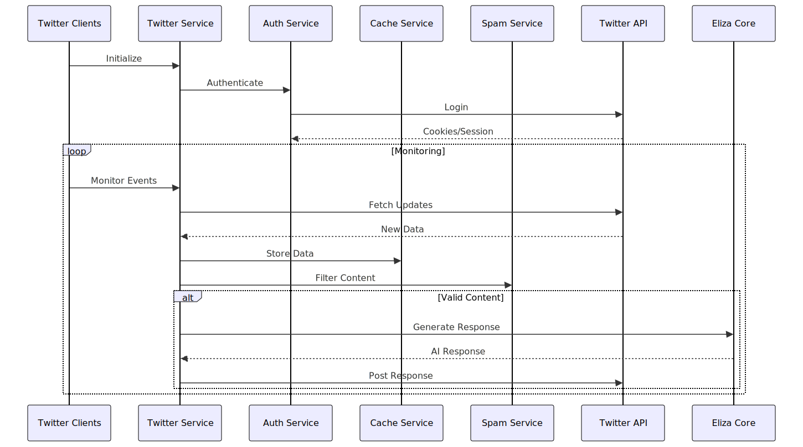
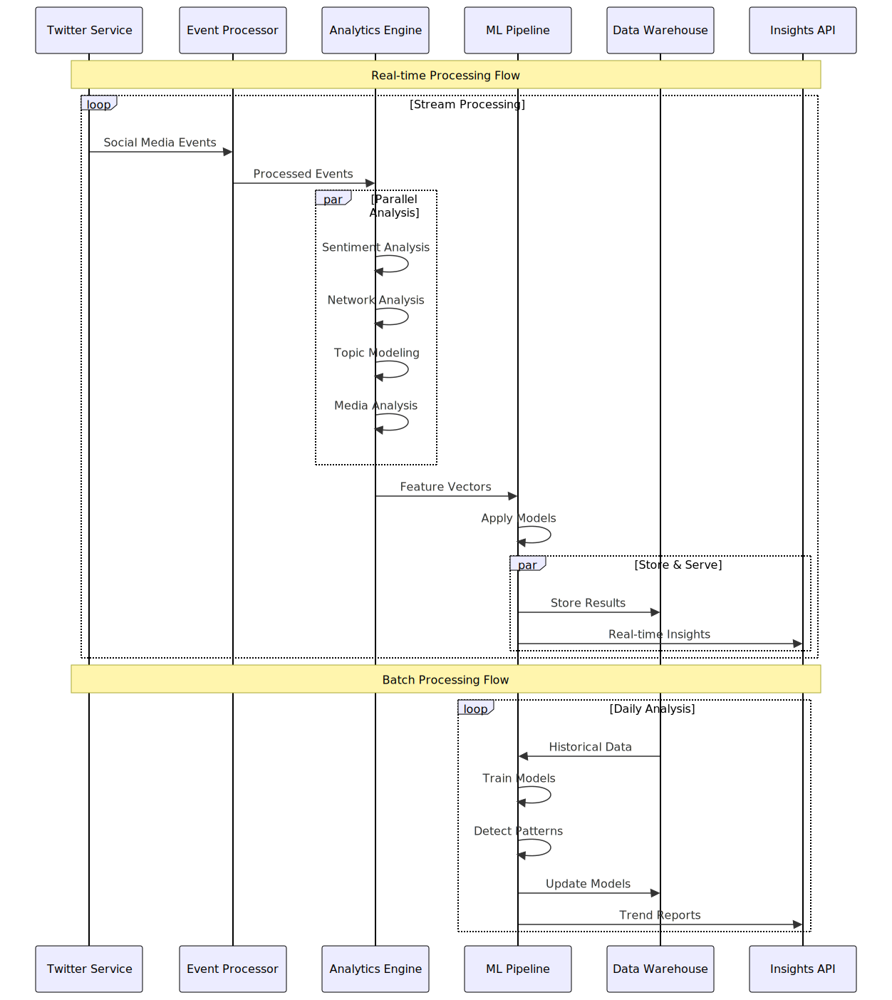

# Twitter Bot Architecture

This document outlines the architecture of the Twitter Bot system using Mermaid diagrams.

## Component Overview

## Data Flow

## Client Details

### Accounts Client Flow

### Search Client Flow

### Interaction Client Flow

### Discovery Client Flow

## Service Responsibilities

### Twitter Service
- Core service managing Twitter interactions
- Coordinates between different components
- Handles authentication and session management
- Manages data caching and spam filtering

### Client Components
- **Accounts Client**: Monitors target accounts and processes their content
- **Search Client**: Performs topic-based searches and processes results
- **Interaction Client**: Handles mentions and direct interactions
- **Discovery Client**: Finds and evaluates new accounts to follow

### Support Services
- **Auth Service**: Manages Twitter authentication and session
- **Cache Service**: Handles data caching to optimize performance
- **Request Service**: Manages API requests with rate limiting
- **Spam Service**: Filters out spam content
- **Config Service**: Manages system configuration
- **Kaito Service**: Integrates with Kaito API for additional data

## Integration with Eliza Core
The system is built on top of the Eliza Core framework, which provides:
- AI response generation
- Memory management
- State handling
- Character/personality management 

## Analytics & Trend Detection Architecture

The following improvements enhance our system's ability to analyze social media data and extract meaningful insights:

### Analytics Components Overview

### Analytics Data Flow

### New Components

#### Analytics Engine
- **Trend Detector**: Identifies emerging trends and patterns in social media content
  - Topic clustering and trend emergence detection
  - Viral content prediction
  - Influence spread tracking
- **Sentiment Analyzer**: Advanced sentiment analysis
  - Multi-language support
  - Context-aware sentiment detection
  - Emotion classification
- **Network Analyzer**: Social network analysis
  - Influence mapping
  - Community detection
  - Information flow analysis

#### Data Processing
- **Stream Processor**: Real-time event processing
  - Event filtering and enrichment
  - Real-time feature extraction
  - Stream aggregation
- **Event Bus**: Scalable event distribution
  - Guaranteed delivery
  - Event replay capabilities
  - Stream partitioning

#### Machine Learning Infrastructure
- **ML Pipeline**: Automated machine learning workflow
  - Model training and validation
  - Feature engineering
  - Model deployment and serving
- **Feature Store**: Centralized feature management
  - Feature versioning
  - Real-time and batch serving
  - Feature sharing across models
- **Model Registry**: Model lifecycle management
  - Version control
  - A/B testing
  - Model performance monitoring

#### Enhanced Data Collection
- **Media Analyzer**: Rich media analysis
  - Image content analysis
  - Video sentiment detection
  - Meme tracking and classification
- **Hashtag Analyzer**: Advanced hashtag analytics
  - Trend prediction
  - Campaign effectiveness
  - Cross-platform correlation
- **User Behavior Tracker**: User interaction analysis
  - Engagement patterns
  - Influence measurement
  - Content preference learning

### Benefits of New Architecture
1. **Improved Trend Detection**
   - Earlier identification of emerging trends
   - Better understanding of trend lifecycle
   - Cross-topic correlation analysis

2. **Enhanced User Understanding**
   - Deeper behavioral insights
   - Better engagement prediction
   - More accurate user segmentation

3. **Better Data Quality**
   - Improved noise filtering
   - Better context preservation
   - More reliable sentiment analysis

4. **Scalable Analytics**
   - Real-time processing capabilities
   - Historical analysis support
   - Flexible data storage options
